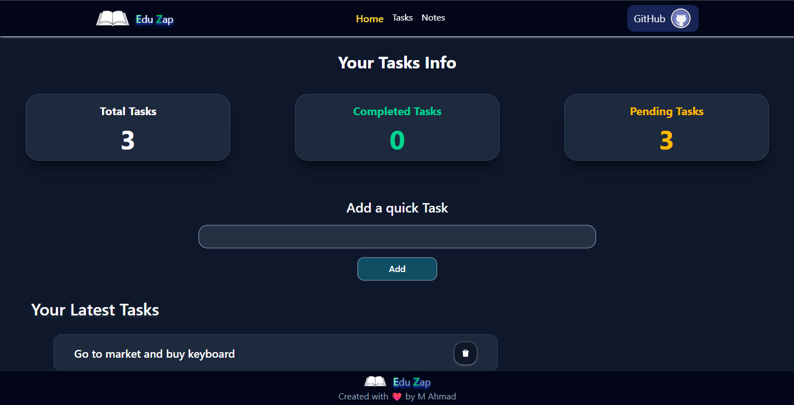
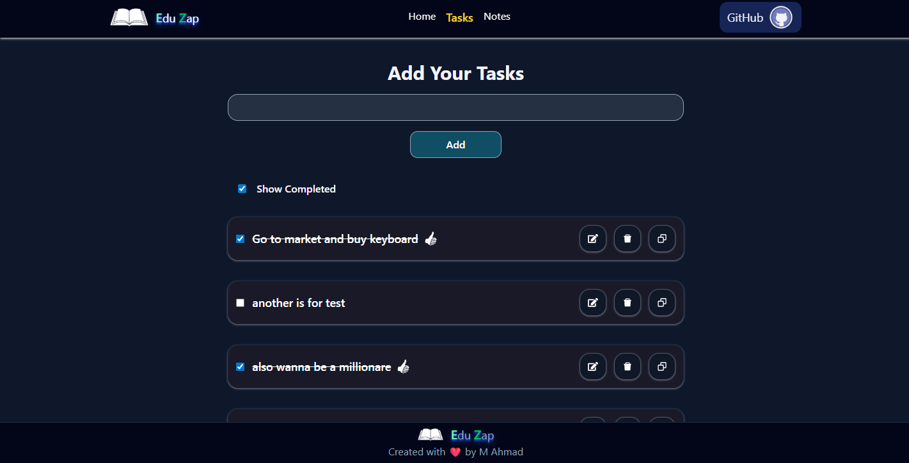
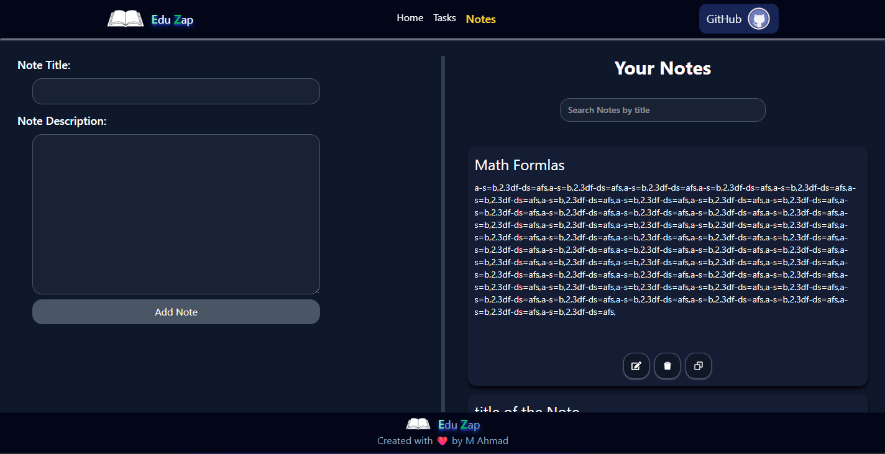

# EduZap v2 Frontend ✨

[](https://reactjs.org/)
[](https://tailwindcss.com/)
[](https://axios-http.com/)
[](LICENSE)

Frontend for **EduZap v2**, a modern task and notes management platform. This version introduces **authentication**, a **dashboard** for tasks, and dedicated pages for **notes** and **tasks**.

🎯 **Live Demo (v1)**: [EduZap v1](https://edu-zap-one.vercel.app/)
*(v2 deployment coming soon!)*

---

## 🚀 Features

* **Authentication** 🔒

  * User registration and login
  * Protected routes for secure access

* **Dashboard** 📊

  * Task stats: completed ✅, pending ⏳, all tasks 📋
  * Quick-add new tasks ➕
  * View your **3 most recent tasks**

* **Tasks Page** 📝

  * Create, view, update, delete tasks

* **Notes Page** 🗒️

  * Add, view, and manage personal notes
  * Search Functionality by title

---

## 🛠 Tech Stack

| Technology                                                                                              | Description             |
| ------------------------------------------------------------------------------------------------------- | ----------------------- |
|                     | Frontend library        |
|  | Styling framework       |
|                | API requests            |
| React Context API                                                                                       | Global state management |

---

## 📸 Screenshots

**Dashboard**



**Tasks Page**



**Notes Page**




---

## ⚡ Getting Started

1. Clone the repository:

   ```bash
   git clone https://github.com/MuhammadAhmadCode/eduzap-v2-frontend.git
   ```
2. Install dependencies:

   ```bash
   npm install
   ```
3. Start the development server:

   ```bash
   npm run dev
   ```

---

## 🔗 Backend

The backend API is hosted separately and manages authentication, tasks, and notes. Ensure it’s running for full functionality.

---

## 📝 License
MIT © M. Ahmad
